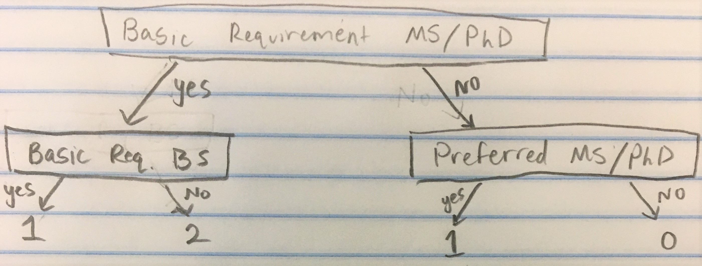

## Introduction
(Introduction Here)

##Include Libraries
```{r setup, include=FALSE}

library(tidyr)
library(rvest)
library(tidyverse)
library(stringr)

```

## Get the Data

We begin by getting our data. We do this by using read_csv. This function will read the csv (Comma Seperated Values) file in our directory, and make a data frame from it. We then change the column names to whatever is appropriate.

```{r}
amazon_df <- read_csv("amazon_jobs_dataset.csv") 

#Changes the column names to be what is in the list
names(amazon_df) <- c("ID", "Position", "Location", "Date", "Description", "Basic_Qual", "Preferred_Qual")


amazon_df <- amazon_df %>% as_data_frame()

#Remove ID, since we will not be using it in our data analysis
amazon_df$ID <- NULL

amazon_df %>% head()
```


## Tidy Data

While we now have our data, it looks like some of the data could be changed to make it more useful. The date is currently a string instead of a date attribute, and the locations would be more valuable to us if they were broken down into Country, state and city. Let's Tidy the data now to make it more useful. 

We will be using regexpr and str_sub here. These are described below

Regular Expressions match string inputs to ensure they are of a certain type. In this scenario, we want inputs that have two commas, indicating that there is a state involved, to have a state attribute. Those that do not should have NA

For more information on regexpr, go to: http://rfunction.com/archives/1719

str_sub gets a substring of a string from a given 'start' to a given 'end', including the character at both locations.

For more information on str_sub, go to: https://www.rdocumentation.org/packages/stringr/versions/0.6.2/topics/str_sub

```{r}

#Change posting date from a string into a date
amazon_df <- readr::type_convert(amazon_df, col_types = cols( Date = col_datetime(format = "%B %d, %Y"), .default = col_character()))

#Add columns Country, State, and City based on the location attribute
amazon_df$Country <- amazon_df$Location %>% str_sub(start = 1, end = 2)

amazon_df$State <- ifelse(regexpr(", [A-Z]{2},", amazon_df$Location) == -1, NA,  amazon_df$Location %>% str_sub(start = 5, end = 6))

amazon_df$City <- ifelse(regexpr(", [A-Z]{2},", amazon_df$Location) == -1, amazon_df$Location %>% str_sub(start = 5),  amazon_df$Location %>% str_sub(start = 8))

amazon_df %>% head()

```

While the data is fairly clean, we have not made much use of the qualifications string. We will now determine requirements from the job postings by using regular expressions.
We will determine:
- Which jobs require graduate school
- What programming languages the job specifies
- Level of experience required for the position


We determined the value for grad school using the model below.
2 -> Graduate school is a requirement
1 -> Graduate school is preferred but not required
0 -> Graduate school is not mentioned

We make it a 1 if it requires both BS and MS/PhD because typically in those cases it says to have either, making a graduate degree preferred, but not required.



```{r}

#Grad school column which determines if graduate school is a requirement for the position (2), a preference (1), or not mentioned (0)
amazon_df$Grad_School <-
  ifelse(regexpr("MS|PhD|Masters|Master's|Doctorate|Graduate School|Grad school", amazon_df$Basic_Qual) != -1, 
    ifelse(regexpr("Bachelor|BS", amazon_df$Basic_Qual) != -1, 1,2), 
         ifelse(regexpr("MS|PhD|Masters|Master's|Doctorate|Graduate School|Grad school", amazon_df$Preferred_Qual) != -1, 1, 0)
  )

#We will make another column on whether an individual is a manager, developer, or neither. This will be helpful to put now so that it is easier for us to do data analysis later
amazon_df$Job_Type <-
  ifelse(regexpr("Manager", amazon_df$Position) != -1, "Manager", 
      ifelse(regexpr("Engineer|Developer|Development|SDE|Lead", amazon_df$Position) != -1, "Developer", 
          ifelse(regexpr("Analyst", amazon_df$Position) != -1, "Analyst",
                 ifelse(regexpr("Scientist", amazon_df$Position) != -1, "Scientist", "Other")
                 )
            )
        )

matchExp <- "(one|two|three|four|five|six|seven|eight|nine|ten|eleven|twelve|[\\d]{1,3})(\\+)? year('s|’s|s)?(.*)? experience"

matchExp

#Column for minimum experience
amazon_df$Minimum_Experience <- str_match(amazon_df$Basic_Qual,matchExp)[,2]


amazon_df[order(amazon_df$Minimum_Experience, decreasing = TRUE),] %>% head()


```

Now we have a lot of helpful information. However, there is a problem with minimum experience. Some of the data does is the character version of the number, "one", "two", etc. Let's fix this.
```{r}

#Convert strings to numbers equivalent
amazon_df$Minimum_Experience[amazon_df$Minimum_Experience == "one"] <- "1"
amazon_df$Minimum_Experience[amazon_df$Minimum_Experience == "two"] <- "2"
amazon_df$Minimum_Experience[amazon_df$Minimum_Experience == "three"] <- "3"
amazon_df$Minimum_Experience[amazon_df$Minimum_Experience =="four"] <- "4"
amazon_df$Minimum_Experience[amazon_df$Minimum_Experience == "five"] <- "5"
amazon_df$Minimum_Experience[amazon_df$Minimum_Experience == "six"] <- "6"
amazon_df$Minimum_Experience[amazon_df$Minimum_Experience == "seven"] <- "7"
amazon_df$Minimum_Experience[amazon_df$Minimum_Experience == "eight"] <- "8"
amazon_df$Minimum_Experience[amazon_df$Minimum_Experience == "nine"] <- "9"
amazon_df$Minimum_Experience[amazon_df$Minimum_Experience == "ten"] <- "10"
amazon_df$Minimum_Experience[amazon_df$Minimum_Experience == "eleven"] <- "11"
amazon_df$Minimum_Experience[amazon_df$Minimum_Experience == "twelve"] <- "12"
amazon_df$Minimum_Experience[is.na(amazon_df$Minimum_Experience) ] <- "0"


#Convert char attribute to number attribute
amazon_df$Minimum_Experience <- as.numeric(amazon_df$Minimum_Experience)

amazon_df %>% head() 

```


Next we will check for the skills wanted for the positions. 2 represents that the skill is a basic qualification for the job, 1 represents a preferred qualificiation for the job, and 0 represents not mentioned.

```{r}
amazon_df$Java <- ifelse(regexpr("Java[^(script)]|Java$", amazon_df$Basic_Qual, ignore.case = TRUE) != -1, 2, ifelse(regexpr("Java[^script]|Java$", amazon_df$Preferred_Qual, ignore.case = TRUE) != -1, 1, 0))  

amazon_df$Python <- ifelse(regexpr("Python", amazon_df$Basic_Qual, ignore.case = TRUE) != -1, 2, ifelse(regexpr("Python", amazon_df$Preferred_Qual, ignore.case = TRUE) != -1, 1, 0))  

#NOTE: \\W ensures that there is something that comes after R that is not a word. Without this, it would detect any word that has an uppercase R ex. Rhino
amazon_df$R <- ifelse(regexpr("\\WR\\W", amazon_df$Basic_Qual) != -1, 2, ifelse(regexpr("\\WR\\W", amazon_df$Preferred_Qual) != -1, 1, 0))  

amazon_df$MATLAB <- ifelse(regexpr("MATLAB", amazon_df$Basic_Qual, ignore.case = TRUE) != -1, 2, ifelse(regexpr("MATLAB", amazon_df$Preferred_Qual, ignore.case = TRUE) != -1, 1, 0))  

amazon_df$"C/C++/C#" <- ifelse(regexpr("\\WC\\W", amazon_df$Basic_Qual) != -1, 2, ifelse(regexpr("\\WC\\W", amazon_df$Preferred_Qual) != -1, 1, 0)) 

amazon_df$PHP <- ifelse(regexpr("PHP", amazon_df$Basic_Qual) != -1, 2, ifelse(regexpr("PHP", amazon_df$Preferred_Qual) != -1, 1, 0)) 

amazon_df$SQL <- ifelse(regexpr("SQL", amazon_df$Basic_Qual) != -1, 2, ifelse(regexpr("SQL", amazon_df$Preferred_Qual) != -1, 1, 0))  

amazon_df$JavaScript <- ifelse(regexpr("JavaScript", amazon_df$Basic_Qual, ignore.case = TRUE) != -1, 2, ifelse(regexpr("JavaScript", amazon_df$Preferred_Qual, ignore.case = TRUE) != -1, 1, 0))

amazon_df$Swift <- ifelse(regexpr("Swift", amazon_df$Basic_Qual) != -1, 2, ifelse(regexpr("Swift", amazon_df$Preferred_Qual) != -1, 1, 0)) 

amazon_df$Perl <- ifelse(regexpr("Perl", amazon_df$Basic_Qual) != -1, 2, ifelse(regexpr("Perl", amazon_df$Preferred_Qual) != -1, 1, 0)) 

amazon_df$Ruby <- ifelse(regexpr("Ruby", amazon_df$Basic_Qual) != -1, 2, ifelse(regexpr("Ruby", amazon_df$Preferred_Qual) != -1, 1, 0)) 

amazon_df$"HTML/CSS" <- ifelse(regexpr("HTML|CSS", amazon_df$Basic_Qual, ignore.case = TRUE) != -1, 2, ifelse(regexpr("HTML|CSS", amazon_df$Preferred_Qual, ignore.case = TRUE) != -1, 1, 0)) 

amazon_df$AWS <- ifelse(regexpr("AWS", amazon_df$Basic_Qual) != -1, 2, ifelse(regexpr("AWS", amazon_df$Preferred_Qual) != -1, 1, 0)) 

amazon_df$UNIX <- ifelse(regexpr("UNIX|Linux", amazon_df$Basic_Qual,ignore.case = TRUE) != -1, 2, ifelse(regexpr("UNIX|Linux", amazon_df$Preferred_Qual,ignore.case = TRUE) != -1, 1, 0)) 

amazon_df$Git <- ifelse(regexpr("Git(Hub)?", amazon_df$Basic_Qual) != -1, 2, ifelse(regexpr("Git(Hub)?", amazon_df$Preferred_Qual) != -1, 1, 0)) 

amazon_df %>% head()

```

Last thing we will do is remove the irrelevant information from the dataset. The Description and desired qualifications can be removed since we will not use them anymore. We can also remove data values that have NAs 
```{r}
amazon_df$Basic_Qual <- NULL
amazon_df$Preferred_Qual <- NULL
amazon_df$Description <- NULL

amazon_df <- na.omit(amazon_df)

amazon_df
```
Now we are FINALLY done tidying the data amazon_df data. Let's do some data analysis on the dataset.

##Data Analysis

SQL stands for Structured Query Language. It is used to ----. 